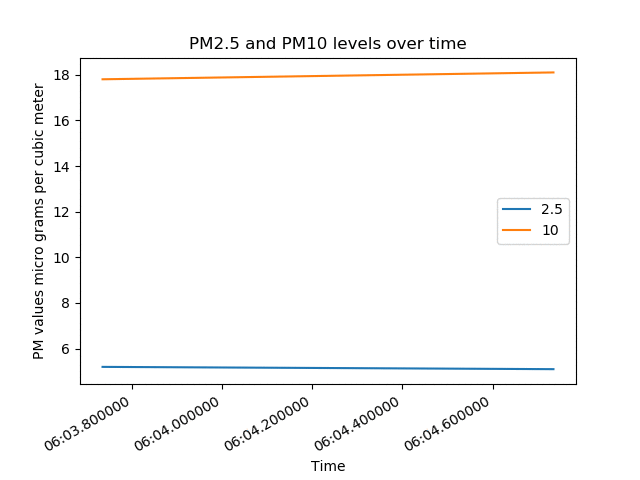
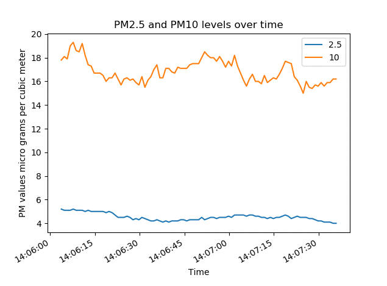

## Introduction


### What you will make

--- no-print ---

In this project in the pathway, you will add a sensor to your air quality monitor, to detect particulate matter in the environment.



--- /no-print ---

--- print-only ---

In this project in the pathway, you will add a sensor to your air quality monitor, to detect particulate matter in the environment.



--- /print-only ---

--- collapse ---
---
title: What you will need
---

### Hardware
+ A Raspberry Pi
+ [An SDS011 particulate matter sensor](https://www.amazon.co.uk/CUHAWUDBA-Sensor-Precision-Quality-Detection/dp/B083ZNZWKW/ref=sr_1_2?keywords=sds011&qid=1579769294&sr=8-2)

### Software

+ [Pyserial](https://matplotlib.org/)
+ [Matplotlib](https://pyserial.readthedocs.io/en/latest/)
+ [Adafruit_IO](https://github.com/adafruit/Adafruit_IO_Python)

```bash
sudo pip3 install matplotlib pyserial adafruit_io
```

### Downloads

+ [SDS011 Datasheet](https://cdn-reichelt.de/documents/datenblatt/X200/SDS011-DATASHEET.pdf)

--- /collapse ---

--- collapse ---
---
title: What you will learn
---

+ How to read data from an SDS011 PM sensor
+ How to create animated graphs
+ How to store data in a csv sheet
+ How to present data on an IOT platform

--- /collapse ---

--- collapse ---
---
title: Additional information for educators
---

If you need to print this project, please use the [printer-friendly version](https://projects.raspberrypi.org/en/projects/project-name/print){:target="_blank"}.

[Here is a link to the resources for this project](http://rpf.io/project-name-go).

--- /collapse ---
