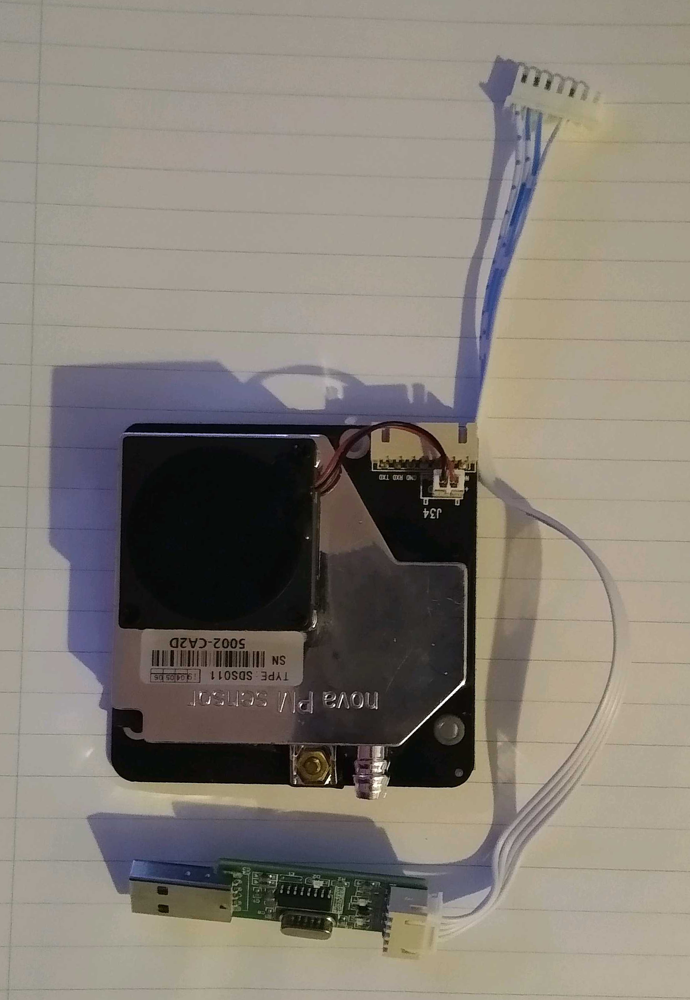
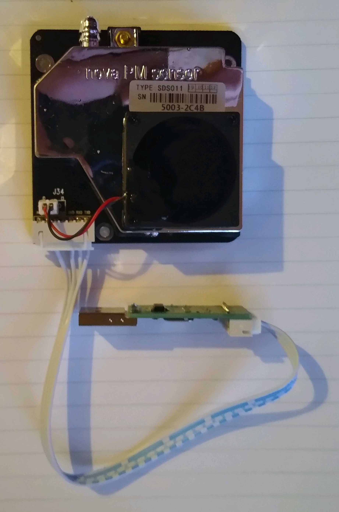
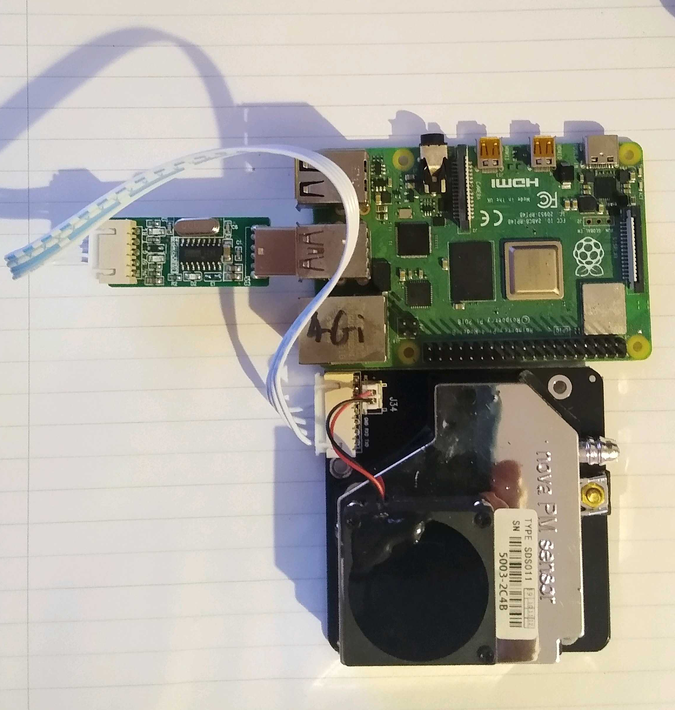

## Devlop - Connect your sensor

The SDS011 connects to your Raspberry Pi via the USB ports.

--- task ---

Remove the SDS011 and the USB adaptor from it's packaging

--- /task ---

--- task ---

Attach the ribbon cable to the SDS011 sensor

--- /task ---

--- task ---

Connect the sensor to you Raspberry Pi using any of the USB ports.

--- /task ---

The sensor's fan should start up, and an LED on the underside of the sensor will begin flashing, as well as a second LED on the USB adaptor.

