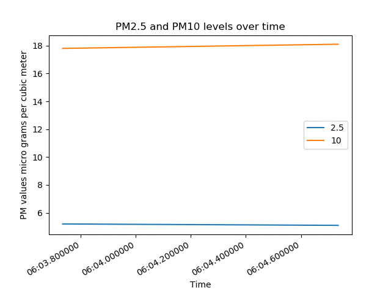

## Develop - Displaying the PM values

Now it is time to display the PM2.5 and PM10 values you are recording. To begin with you will use matplotlib to create an animated graph, that will contuously update with the sensors data.

[[[generic-python-animated-graph]]]



--- task ---
Create an animated graph that displays the changes in PM2.5 and PM10 over time.

Here's an outline of what your `animate()` function should look like.

```python
times = []
pm_two_five_data = []
pm_ten_data = []


def animate(i, times, pm_two_five_data, pm_ten_data):
	
	pm_two_five, pm_ten = collect_data
	time = datetime.now()
	
	#Append pm_two_five, pm_ten and time to their respective lists
	
	#Clear the axis
	
	#Draw the title and axis labels
	
	#Plot both data sets against time
	
	#Add a legend
	
	#Autoformat the datetime
	
#Call the animation function with FuncAnimation every 5 seconds

#Show the plot
```
--- /task ---
